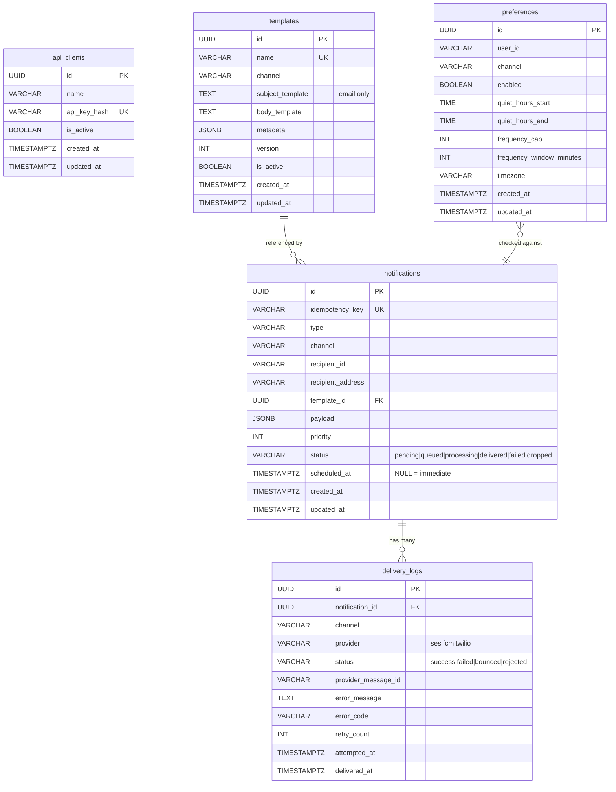
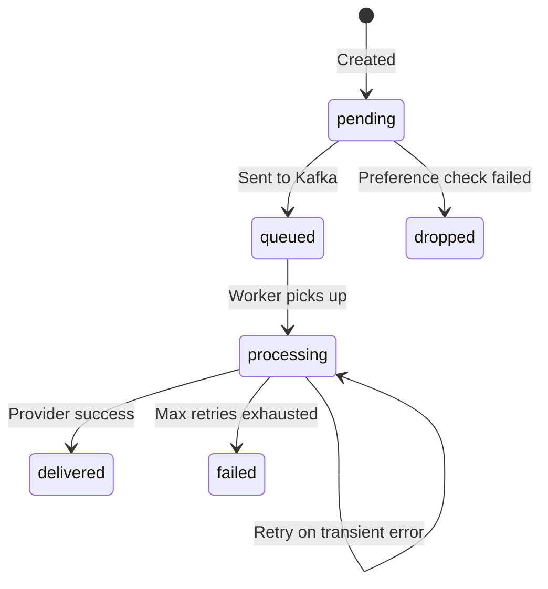

# Database Schema

## Notification Lifecycle

## Key Constraints

| Table           | Constraint                 | Purpose                             |
| --------------- | -------------------------- | ----------------------------------- |
| `api_clients`   | `UNIQUE(api_key_hash)`     | One key per client                  |
| `templates`     | `UNIQUE(name)`             | Lookup by name                      |
| `preferences`   | `UNIQUE(user_id, channel)` | One preference per user per channel |
| `notifications` | `UNIQUE(idempotency_key)`  | Prevent duplicate sends             |
| `delivery_logs` | `FK(notification_id)`      | Links attempts to notification      |

## Indexes

| Index                           | Table         | Purpose                             |
| ------------------------------- | ------------- | ----------------------------------- |
| `idx_templates_channel`         | templates     | Filter by channel                   |
| `idx_templates_name`            | templates     | Lookup by name                      |
| `idx_preferences_user`          | preferences   | Lookup by user_id                   |
| `idx_notifications_status`      | notifications | Filter by status                    |
| `idx_notifications_recipient`   | notifications | Filter by recipient                 |
| `idx_notifications_scheduled`   | notifications | Partial: pending + has scheduled_at |
| `idx_notifications_idempotency` | notifications | Partial: non-null idempotency keys  |
| `idx_notifications_created`     | notifications | Sort by creation time               |
| `idx_delivery_notification`     | delivery_logs | Join to notification                |
| `idx_delivery_status`           | delivery_logs | Filter by delivery status           |
| `idx_delivery_attempted`        | delivery_logs | Sort by attempt time                |
